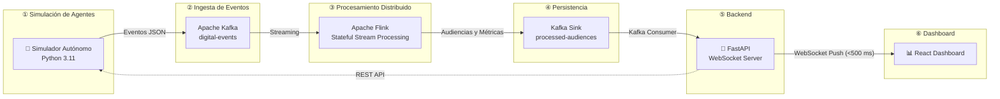

# 🚀 Plataforma Inteligente para Simulación y Análisis de Audiencias Digitales en Tiempo Real

> **Arquitectura Orientada a Eventos (EDA)** para la simulación, procesamiento y análisis de audiencias digitales en tiempo real utilizando **Apache Kafka, Apache Flink, FastAPI y React**.


---

# 📌 Contexto y Descripción del Proyecto

En el contexto actual de la analítica de datos, el almacenamiento y análisis tradicional mediante procesamiento por lotes (**Batch Processing**) resulta insuficiente para escenarios que requieren decisiones inmediatas. La presente plataforma resuelve esta limitación implementando una **Arquitectura Orientada a Eventos (EDA)** que ingiere, procesa y visualiza la actividad de usuarios digitales en el instante exacto en que ocurre.

El sistema simula la interacción continua de cientos de usuarios representados por agentes autónomos, cuyos comportamientos se adaptan a patrones psicológicos específicos y escenarios globales de mercado. Los eventos emitidos son capturados por **Apache Kafka**, procesados mediante ventanas de tiempo con estado en **Apache Flink**, y transmitidos mediante **WebSockets (FastAPI)** hacia un **Dashboard Analítico (React)** con latencia sub-segundo.

---

# 🏗️ Arquitectura General del Sistema

La plataforma se encuentra organizada en **seis capas funcionales desacopladas**, permitiendo escalabilidad horizontal, procesamiento distribuido y comunicación completamente orientada a eventos.



---

# 📋 Pipeline Completo del Sistema

```text
+-------------------------------------------------------------------------------------------------------------------+
|                                 PLATAFORMA INTELIGENTE DE AUDIENCIAS DIGITALES EN TIEMPO REAL                    |
|                                   Arquitectura Orientada a Eventos (EDA) | UNSA Big Data 2026                    |
+-------------------------------------------------------------------------------------------------------------------+

  [ CAPA 1: SIMULACIÓN DE AGENTES ]        [ CAPA 2: INGESTA DE EVENTOS ]         [ CAPA 3: PROCESAMIENTO DISTRIBUIDO ]
 +----------------------------------+     +--------------------------------+     +----------------------------------+
 | SIMULADOR AUTÓNOMO               |     | APACHE KAFKA CLUSTER           |     | APACHE FLINK ENGINE              |
 | (Python 3.11 / Producers)        |     | (Docker en AWS EC2)            |     | (PyFlink Stream Processing)      |
 |                                  |     |                                |     |                                  |
 | 8 Perfiles de Agentes            |     | Topic: digital-events          |     | Time Windows (Sliding 0.5s)      |
 |   - Compulsivo   - Comparador    |     |   +-- Partición 0 (agent_id)   |     | KeyBy(agent_id) + State Store    |
 |   - Nocturno     - Premium       |---->|   +-- Partición 1 (agent_id)   |---->| Reglas de Clasificación          |
 |   - Frecuente    - Indeciso      | JSON|   +-- Partición 2 (agent_id)   | JSON|   - Audiencias Digitales         |
 |   - Explorador   - Estacional    |     |                                |     |   - Tasa de Conversión           |
 |                                  |     | Topic: system-control          |     |   - Detección de Anomalías       |
 | Motor de Escenarios Globales     |     |   +-- Partición 0 (Broadcast)  |     |                                  |
 |   (Navidad, Cyber, Fiestas Pat.) |     +--------------------------------+     +----------------------------------+
 +----------------------------------+                                                      |
                                                                                           | Métricas Procesadas
                                                                                           v
  [ CAPA 6: PRESENTACIÓN Y ACCIÓN ]        [ CAPA 5: BACKEND & WEBSOCKETS ]       [ CAPA 4: SALIDA Y PERSISTENCIA ]
 +----------------------------------+     +--------------------------------+     +----------------------------------+
 | REACT DASHBOARD (Frontend)       |     | FASTAPI BACKEND SERVER         |     | APACHE KAFKA SINK                |
 | (Vite + Recharts + Tailwind)     |     | (Python Web Framework)         |     | (Docker en AWS EC2)              |
 |                                  |     |                                |     |                                  |
 | KPIs en Vivo                     |<----+ Kafka Consumer Loop            |<----+ Topic: processed-audiences      |
 | Funnel de Conversión             | WS  | WebSocket Server Push          | JSON| Topic: dashboard-metrics         |
 | Audiencias Detectadas            |0.5s | REST API Controller            |     |                                  |
 | Live Stream                      |     |                                |     |                                  |
 | Automatización de Acciones       |     |                                |     |                                  |
 +----------------------------------+     +--------------------------------+     +----------------------------------+
```

---

# ⚙️ Especificación Técnica de las Capas de la Solución

## 🟦 Capa 1: Simulación de Agentes Autónomos y Escenarios

Implementa hilos independientes en **Python 3.11** para generar flujos continuos de eventos estructurados en formato **JSON**. Cada agente modela un patrón específico de comportamiento dentro del ecosistema digital.

| Perfil de Agente | Patrón de Interacción y Comportamiento Generado |
| :--- | :--- |
| **🛒 Comprador Compulsivo** | Elevada tasa de conversión, intervalos de decisión mínimos y pocas consultas de producto. |
| **🔍 Comparador** | Alto volumen de eventos `VIEW_PRODUCT` y `COMPARE_PRICE`, con baja tasa de conversión. |
| **🌙 Comprador Nocturno** | Generación de eventos concentrada únicamente entre las 00:00 y las 06:00 horas. |
| **💎 Cliente Premium** | Baja frecuencia de compra, pero con importes elevados (`cart_value > $1500`). |
| **🔁 Cliente Frecuente** | Emisión constante de eventos de compra en intervalos regulares. |
| **🧭 Usuario Explorador** | Navegación intensiva mediante `VIEW_PRODUCT` sin ejecutar compras. |
| **🤔 Cliente Indeciso** | Alterna repetidamente entre `ADD_TO_CART` y `REMOVE_FROM_CART` antes de abandonar o comprar. |
| **🎄 Cliente Estacional** | Modifica dinámicamente su comportamiento según el escenario empresarial activo. |

### 🌎 Motor de Escenarios Globales

Permite alterar dinámicamente la velocidad y distribución del comportamiento de todos los agentes mediante el tópico **`system-control`**, simulando campañas como:

- 🎄 Navidad
- 🛍️ Cyber Monday
- 🇵🇪 Fiestas Patrias
- 🎒 Campaña Escolar

---

## 🟨 Capa 2 y Capa 4: Clúster de Ingesta y Egresos (Apache Kafka)

Apache Kafka actúa como el **bus principal de mensajería asíncrona**, desacoplando completamente la generación de eventos del procesamiento analítico.

### Tópicos de Kafka

| Tópico | Función |
|---------|---------|
| **digital-events** | Flujo principal de eventos generados por los agentes. Particionado mediante `agent_id` para mantener el orden secuencial de cada usuario. |
| **system-control** | Canal de control en modo broadcast para modificar escenarios globales en tiempo real. |
| **processed-audiences** | Publicación de las audiencias clasificadas por Apache Flink. |
| **dashboard-metrics** | Publicación de métricas agregadas destinadas al Dashboard Analítico. |

---

## 🟧 Capa 3: Motor de Procesamiento en Streaming (Apache Flink)

Utiliza **PyFlink** para ejecutar procesamiento distribuido con estado (**Stateful Stream Processing**) sobre ventanas de tiempo deslizantes de **0.5 segundos**.

### Procesamiento realizado

- **KeyBy(`agent_id`)**
  - Mantiene el estado independiente de cada usuario.

- **Sliding Windows (0.5 segundos)**
  - Evalúa continuamente el comportamiento reciente de la audiencia.

### Reglas de Clasificación

- Riesgo de abandono

```text
count(REMOVE_FROM_CART) > count(ADD_TO_CART)
```

- Alta intención de compra

```text
count(ADD_TO_CART) >= 2
```

### Resultados producidos

- Segmentación automática de audiencias.
- Cálculo de tasa de conversión instantánea.
- Detección de anomalías.
- Generación continua de métricas para visualización.

---

## 🟩 Capa 5: Backend & WebSockets (FastAPI)

Servidor desarrollado en **Python + FastAPI**, encargado de comunicar Apache Kafka con la interfaz web mediante comunicación bidireccional en tiempo real.

### Componentes

- **Kafka Consumer Loop**
  - Consume continuamente las métricas procesadas desde Kafka.

- **WebSocket Server Push**
  - Envía información al Dashboard con una latencia inferior a **500 ms**.

- **REST API Controller**
  - Expone endpoints para modificar dinámicamente el escenario global de simulación.

---

## 🟪 Capa 6: Presentación y Acción (React Dashboard)

Dashboard desarrollado con **React**, **Vite**, **TailwindCSS** y **Recharts**, orientado al monitoreo de audiencias digitales en tiempo real.

### Funcionalidades principales

1. 📈 KPIs en tiempo real
   - Usuarios activos.
   - Eventos por segundo (EPS).
   - Medidor de conversión.

2. 🛍️ Distribución de Eventos y Productos
   - Productos más visitados.
   - Productos más comprados.
   - Distribución por tipo de evento.

3. 🌎 Métricas Geográficas y Temporales
   - Compras por región.
   - Tendencias temporales.

4. 🎯 Segmentación y Funnel
   - Embudo de conversión.
   - Audiencias detectadas dinámicamente.

5. 📡 Live Stream
   - Trazabilidad completa del procesamiento.
   - Comparación Kafka vs Flink.

6. ⚡ Activación Automática de Acciones
   - Pop-ups personalizados.
   - Notificaciones Push.
   - Alertas de fraude.
   - Asignación automática de soporte VIP.

---

# 📊 Dashboard Analítico

El Dashboard permite visualizar continuamente el estado del sistema mediante indicadores y gráficas actualizadas en tiempo real.

- 📈 KPIs de usuarios activos.
- ⚡ Eventos procesados por segundo.
- 🎯 Funnel de conversión.
- 🛒 Productos más visitados.
- 💰 Productos más comprados.
- 🌎 Compras por región.
- 📡 Live Stream de eventos.
- 🚨 Alertas automáticas.
- 👥 Segmentación dinámica de audiencias.

---

# 🛠️ Tecnologías Utilizadas

| Categoría | Tecnología |
|-----------|------------|
| Lenguaje | Python 3.11 |
| Streaming | Apache Kafka |
| Procesamiento | Apache Flink (PyFlink) |
| Backend | FastAPI |
| Frontend | React + Vite |
| Visualización | Recharts |
| Contenedores | Docker |
| Infraestructura | AWS EC2 |
| Arquitectura | Event-Driven Architecture (EDA) |

---

# 📂 Estructura del Proyecto

```text
realtime-audience-intelligence/
│
├── agent-generator/        # Simulador de Agentes Autónomos (Python 3.11)
│   ├── main.py             # Productor principal que envía eventos a Kafka
│   ├── agents.py           # Modelado conductual de los 8 perfiles de usuario
│   └── scenarios.py        # Inyección de escenarios globales (Navidad, Cyber, etc.)
│
├── flink-job/              # Motor de Procesamiento en Streaming (PyFlink)
│   ├── stream_processor.py # Job continuo de Flink con ventanas deslizantes (0.5s)
│   └── rules.py            # Reglas con estado para clasificación de audiencias
│
├── backend/                # Servidor FastAPI y WebSockets
│   ├── main.py             # Instancia API REST y servidor WebSocket push (<500ms)
│   ├── kafka_consumer.py   # Consumidor asíncrono de los tópicos de egreso en Kafka
│   └── requirements.txt    # Dependencias del servidor de aplicación
│
├── dashboard/              # Interfaz de Usuario Analítica en Tiempo Real (React)
│   ├── src/                # Componentes visuales (KPIs, Funnel, Live Stream)
│   ├── package.json        # Gestión de paquetes (Vite, Recharts, TailwindCSS)
│   └── vite.config.js      # Configuración del servidor de desarrollo frontend
│
├── docker-compose.yml      # Orquestación de infraestructura (Kafka + Zookeeper)
├── .gitignore              # Exclusión de claves .pem, entornos virtuales y venv
└── README.md               # Documentación oficial y arquitectura del sistema
```

---


# 📜 Licencia

Este proyecto se distribuye bajo la licencia **MIT License**.
